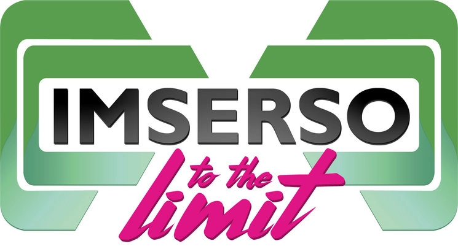
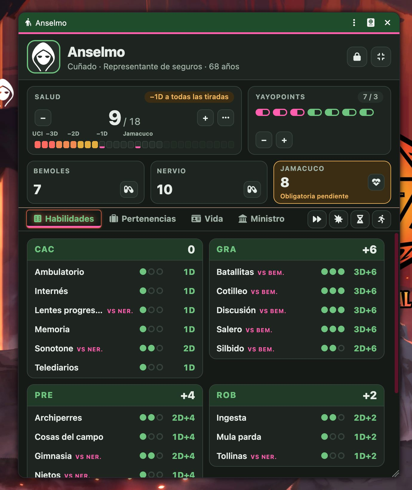
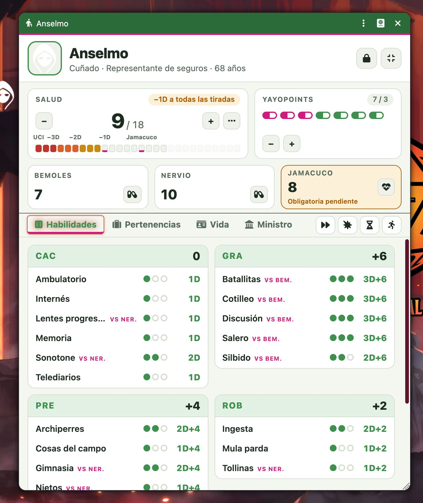
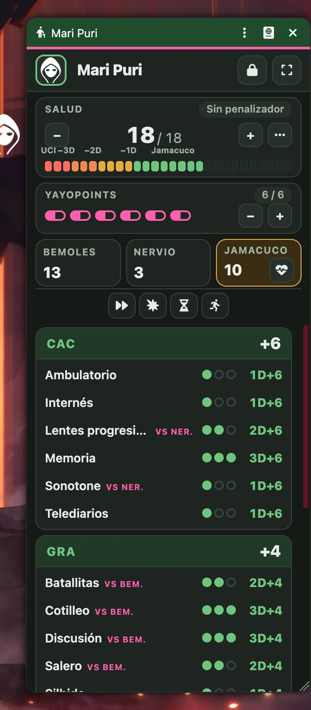
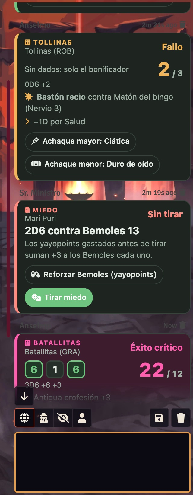
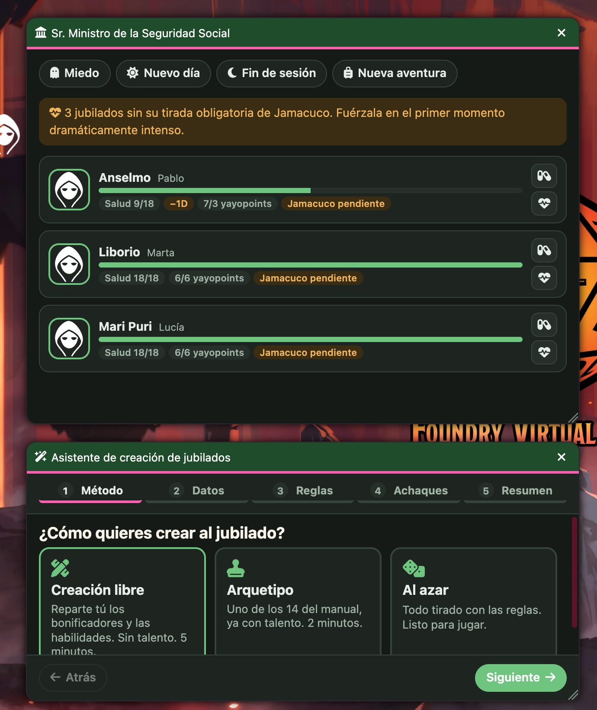

<div align="center">



# ¡Que salga el autocar!

**El sistema de Foundry VTT para *IMSERSO to the limit*: jubilados de viaje, achaques, yayopoints y la sombra permanente del jamacuco.**
Todas las reglas del YayoSystem automatizadas, una ficha preciosa y el Sr. Ministro con la mesa bajo control.

  <a href="https://github.com/ManuRomera/imserso-to-the-limit/releases/latest"></a>
  <a href="https://foundryvtt.com"></a>
  <a href="https://github.com/ManuRomera/imserso-to-the-limit/releases"></a>
  
  <a href="LICENSE.md"></a>

### [⬇️ Descargar la última versión](https://github.com/ManuRomera/imserso-to-the-limit/releases/latest)

</div>

---

## Instalar en 20 segundos

1. En Foundry, ve a **Sistemas de juego → Instalar sistema**.
2. Pega esta URL en **URL del manifiesto** y pulsa **Instalar**:

```text
https://github.com/ManuRomera/imserso-to-the-limit/releases/latest/download/system.json
```

3. Crea un mundo con el sistema. Al crear tu primer jubilado se abre solo el asistente.

> Necesitas el manual original de *IMSERSO to the limit* (Rolecat). Este sistema contiene las reglas, no el libro.

---

## Una ficha pensada para jugar, no para rellenar

<p align="center">
  
  
</p>

- **Todo lo vital a la vista:** Salud con su barra por zonas (los umbrales de Jamacuco marcados), yayopoints como pastillas, Bemoles, Nervio y Jamacuco.
- **Un clic = una tirada.** Las 20 habilidades agrupadas por atributo, con dados, total y contra qué se tiran.
- **Claro y oscuro**, con letra suave y buen contraste.
- **Modo compacto** (la ficha entera en 330 px, ideal para tener cuatro abiertas) y **candado de edición** para no tocar atributos sin querer.
- **Las ventanas se acuerdan** de su posición, tamaño, pestaña y modo, por usuario.
- **Accesibilidad:** icono junto al de cerrar con tamaño de texto, alto contraste, fuente de alta legibilidad, reducir movimiento y ayuda inmediata.
- **Encuadre del retrato:** elige qué zona de la imagen se ve y con cuánto zoom; se ve igual en la ficha, el panel del Sr. Ministro, el directorio y el combate.

<p align="center">
  
  
</p>

## Las reglas, hechas por ti

| Del manual | En Foundry |
|---|---|
| **Tiradas** 1-3D6 + atributo, +3 por antigua profesión | Diálogo con todo: profesión, talento, yayopoint, flashback, **acciones al alimón** y **capotes** |
| **Críticos y pifias** | Detectados solos; el crítico da yayopoint (con *Carpe diem*, dos) |
| **Achaques** | Los activa **solo el Sr. Ministro** desde la tarjeta: repite la tirada, −1D y yayopoint en el mayor, una vez por sesión en el menor |
| **Yayopoints** | Repetir dados concretos, +1D previo, +3 a Bemoles/Nervio durante un turno, +1D6 de daño (máx. 3) |
| **«Es que yo a tus años…»** | Una vez por sesión, controlado |
| **Peleas** | Iniciativa en el *tracker* (1D6 fijo + PRE + arma, un 6 = acción extra, sorpresa), ataque contra el token marcado, apuntar, críticos que doblan, **defensa activa** con sus dificultades y daño que se aplica con un botón |
| **Salud y Jamacuco** | Penalizadores −1D/−2D/−3D automáticos, **umbrales 15-10-6-3-1** que te piden la tirada, la barra del token pasa por las reglas |
| **Miedo** | Gravedad 1-5 contra Bemoles, con refuerzo de yayopoints antes de tirar |
| **Otras cosas que hacen daño** | Asfixia, caída (¡y la cadera!), frío, deslome, veneno, hambre, sed, cogorza (−1D 6 h), quemaduras |
| **Curación** | Todas las fuentes del manual, **una vez al día / por sesión** y sin acumularse cuando no toca |
| **Persecuciones** | Tarjeta con las tres distancias, captura, huida, críticos y pifias |
| **Empeoramiento** | Al acabar la aventura, −1 a un atributo |
| **Talentos de arquetipo** | Meditar, *Sugar power*, *Hércules Farnesio*, *Ojo de Halcón*, +3 pedante… |

<p align="center">
  
</p>

## Para el Sr. Ministro

El **panel del Sr. Ministro** reúne a todos los jubilados (Salud, yayopoints, Jamacuco pendiente, estados) y las acciones de mesa: **miedo**, premiar yayopoints, **nuevo día**, **fin de sesión** (quita los yayopoints sobrantes, devuelve lo «una vez por sesión» y te chiva quién no ha tirado su Jamacuco) y **nueva aventura** (Salud nueva, yayopoints iniciales, umbrales a cero).

## Crea jubilados en dos minutos

El **asistente** sigue el manual paso a paso: creación libre (con el reparto 0/+2/+4/+6 y las 4×3D + 6×2D validado), **los 14 arquetipos** con su talento, o **al azar** con todas las tiradas (partido con 2D6, Salud con 1D6 y achaques de la lista de 100).

## Dentro del sistema

- **Compendios:** los 14 arquetipos, la hoja de ayuda al jubilado, los encartes y la **tabla de los 100 achaques**.
- **Compatibilidad:** verificado en Foundry VTT 13; preparado para 14 (API V2 encaminada en `module/compat.mjs`).
- **Fiable:** modelos de datos con validación, 15 pruebas automáticas de las reglas, comprobación estática y publicación por etiqueta.
- **Aventuras:** compatible con el módulo [Los Abuelos de la Justicia](https://github.com/ManuRomera/los-abuelos-de-la-justicia).

## Aviso legal

Sistema **no oficial**, sin afiliación ni aprobación de los autores o titulares de *IMSERSO to the limit*. Requiere el manual original. Las reglas se reproducen como contenido abierto bajo la **Open Game License**; las ilustraciones, el logotipo y el resto del libro son identidad de producto de sus titulares. El código y los recursos propios del paquete se rigen por [`LICENSE.md`](LICENSE.md).

## Contribuir

¿Has encontrado un fallo o quieres una regla más automatizada? Abre una [incidencia](https://github.com/ManuRomera/imserso-to-the-limit/issues). Para desarrollar:

```bash
npm ci
npm test        # reglas
npm run check   # sintaxis, plantillas, recursos y versión
npm run build   # compila los compendios (cierra Foundry antes)
```

Hecho con cariño para nuestros mayores, por [Manu Romera](https://github.com/ManuRomera). *Queridos abuelos: ahora, por fin, sois los héroes de la película.*

---

<p align="center">
  <a href="https://github.com/ManuRomera">
    <picture>
      <source media="(prefers-color-scheme: dark)" srcset="https://raw.githubusercontent.com/ManuRomera/ManuRomera/main/brand/MR_09_Monograma_Marfil_Transparente.png">
      
    </picture>
  </a><br>
  <sub>Hecho por <a href="https://github.com/ManuRomera"><b>Manu Romera</b></a> · Digital RPG Design</sub>
</p>
